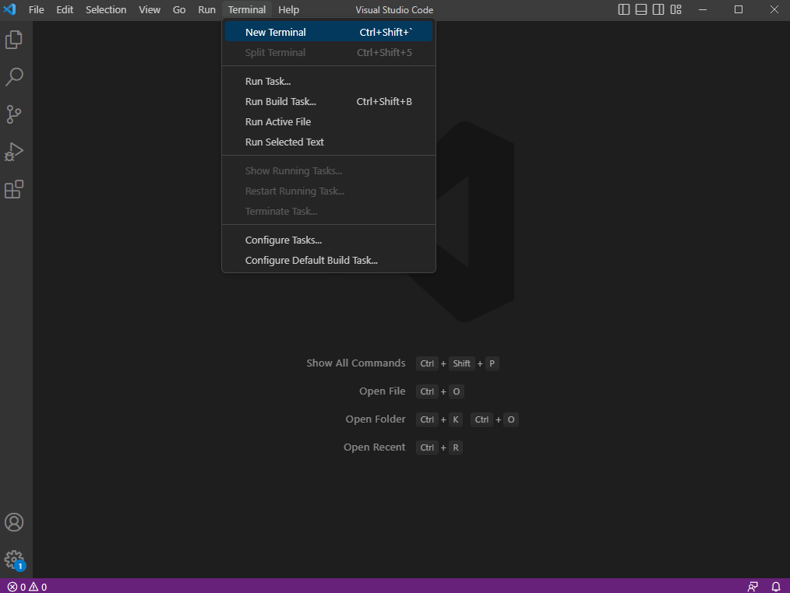

# Week 1 Lab Report
This is a tutorial on how to log into `ieng6`, a UCSD CSE 15L course-specific account

## **Step 1: Installing Visual Studio Code**
This is the main program that will be used in this course. Install [VSCode](https://code.visualstudio.com/) and open it when it is done installing. It should look something like this:

## **Step 2: Installing Git Bash**
Git Bash is the terminal that will be used to access the course account. Install [git](https://gitforwindows.org/) and go through the installer. Once installed, you can open the git bash terminal through VSCode by opening a new terminal with Ctrl + ` or clicking on *Terminal* at the top of the window and clicking on new terminal. 

Then press the down arrow next to the plus sign here, and select *Git Bash*.

## **Step 3: Connecting to the Account**
In the terminal make sure to type: 

`$ ssh cs15lwi23___@ieng6.ucsd.edu`

The dollar sign will be there already and remember to replace the blank space with your own account details.
