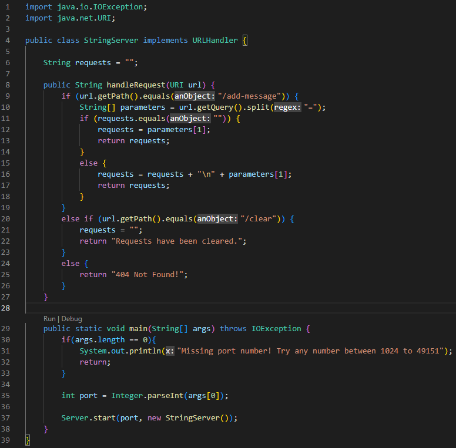
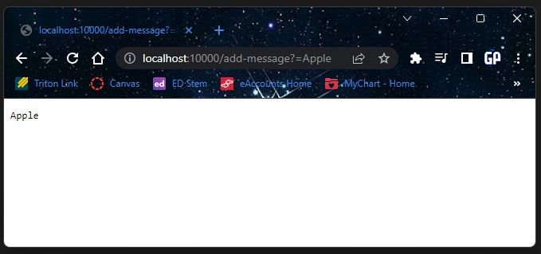

# Week 3 Lab Report
By: Allen Yan

PID: A17685719

---
## Part 1: StringServer

I used the code from [Lab 2](https://ucsd-cse15l-w23.github.io/week/week2/#the-urlhandler-interface) to create a local web server and changed what would be returned on the page based on the URL.

My StringServer code below:



2 screenshots of using /add-message below:



This image shows the message "Apple" being added and printed on the page. The method `handleRequest(URI url)` is being used to read the url, and taking the message that will be added to the final string. The argument of the method is the full url of the web server and the variable `String requests` is being changed each time the web server is loaded with a specific message in the url.


This image shows the message "Orange" being added to the final string. The method `handleRequest(URI url)` is being used to read the url again, and taking the message that will be added. The argument of the method is the full url of the web server and the variable `String requests` is being changed by taking the original requests string and adding a new line with `\n`, and then the new message. The value of `URI url` is also different since it is adding a new message.

---
## Part 2: Bugs

The bug I will be talking about is the merge method in the ListExamples.java file.

Test that is failure-inducing:
```
@Test
    public void testMerge() {
        List<String> list1 = new ArrayList<>();
        list1.add("a"); list1.add("c"); list1.add("d");

        List<String> list2 = new ArrayList<>();
        list2.add("a"); list2.add("b"); list2.add("d"); list2.add("e"); list2.add("f");

        List<String> output = new ArrayList<>();
        output.add("a"); output.add("a"); output.add("b"); output.add("c"); 
        output.add("d"); output.add("d"); output.add("e"); output.add("f");
 
        assertEquals(output, ListExamples.merge(list1,list2));
    }
```

Test that is not failure-inducing:
```
@Test
    public void testMerge2() {
        List<String> list1 = new ArrayList<>();
        list1.add("a"); list1.add("c"); list1.add("d"); list1.add("f");

        List<String> list2 = new ArrayList<>();
        list2.add("a"); list2.add("b"); list2.add("e");
        
        List<String> output = new ArrayList<>();
        output.add("a"); output.add("a"); output.add("b"); output.add("c"); 
        output.add("d"); output.add("e"); output.add("f");

        assertEquals(output, ListExamples.merge(list1,list2));
    }
```

Output of the failure-inducing test:


Output of the non-failure-inducing test:


Original code with the bug:
```
static List<String> merge(List<String> list1, List<String> list2) {
    List<String> result = new ArrayList<>();
    int index1 = 0, index2 = 0;
    while(index1 < list1.size() && index2 < list2.size()) {
      if(list1.get(index1).compareTo(list2.get(index2)) < 0) {
        result.add(list1.get(index1));
        index1 += 1;
      }
      else {
        result.add(list2.get(index2));
        index2 += 1;
      }
    }
    while(index1 < list1.size()) {
      result.add(list1.get(index1));
      index1 += 1;
    }
    while(index2 < list2.size()) {
      result.add(list2.get(index2));
      index1 += 1;
    }
    return result;
  }
```

Code after bug is removed:
```
static List<String> merge(List<String> list1, List<String> list2) {
    List<String> result = new ArrayList<>();
    int index1 = 0, index2 = 0;
    while(index1 < list1.size() && index2 < list2.size()) {
      if(list1.get(index1).compareTo(list2.get(index2)) < 0) {
        result.add(list1.get(index1));
        index1 += 1;
      }
      else {
        result.add(list2.get(index2));
        index2 += 1;
      }
    }
    while(index1 < list1.size()) {
      result.add(list1.get(index1));
      index1 += 1;
    }
    while(index2 < list2.size()) {
      result.add(list2.get(index2));
      index2 += 1;
    }
    return result;
  }
```

The reason this fixed it was because in the third while loop, it increases index1, which means it will never leave the while loop. Changing it to increase index2 will eventually make the comparison false.

---
## Part 3: What I Learned

Something I learned was how to create a web server with java. What I wanted to learn was be able to create something that runs outside of the IDE, and Lab 2 taught me how to to that. Reading over the provided files was a little confusing but I understand the basic idea of them.
