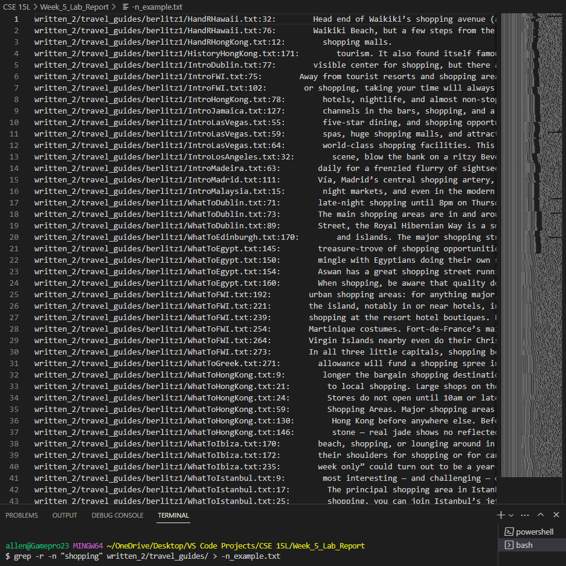

# Week 5 Lab Report
By: Allen Yan

PID: A17685719

---
I chose the `grep` command and found the following 4 interesting options:

`-r` - recursively checks through all files in a given directory

`"word$"` - finds lines that end with word

`-C(number of lines)` - prints the searched line and number of lines before and after that line

`-n` - finds matching lines and the line numbers

---
## Using `-r`

Example 1:

This looked through all files in the written_2/ directory and found all lines that have "lake" in them. It is useful for finding which files have a certain word.

Example 2:

This looked through all files in the written_2/non-fiction/ directory and found all lines that have "stars" in them. It is useful for finding which files have a certain word in a certain directory.

---
## Using `"word$"`

Example 1:

This looked through a text file and found all of the lines that end in "a". This is useful for finding which lines end in a certain word, especially if your file is sorted in a certain way.

Example 2:

I combined this option with the `-r` option to check multiple text files. This looked through all text files in the written_2/travel_guides/ directory and found all of the lines that end in "seven". This can be useful to check the end of a line in multiple different files.

---
## Using `-C(number of lines)`

Example 1:

This command found the line with the word "signatures" in the WhereToLosAngeles.txt file, and printed the line as well as the 3 lines before and after it. It can be useful for finding a line and the context of it.

Example 1:

This command found the line with the word "signatures" in multiple text files in the written_2/ directory. I combined it with the `-r` option, which can be useful to find multiple lines and context in different files.

---
## Using `-n`

Example 1:

This command finds a certain word in a file and the line number of the line that contains that word. This can be useful to find where a word is in a text file and then be able to use the number and find it easily in the actual text file.

Example 2:

I combined the `-n` option with the `-r` option to search for a word and line number in multiple files in a given directory. This can be useful to look for something in multiple files and be able to find the line that contains the word you want in any file.

---

## Works Cited

For the `-r` option, I looked up "how to use grep recursively" and the first result was this website: 

[Grep Command in Linux (Find Text in Files)](https://linuxize.com/post/how-to-use-grep-command-to-search-files-in-linux/#:~:text=cache%20manager%20process-,Recursive%20Search,symlinks%20that%20are%20encountered%20recursively.)

For the other options, I looked up "different grep options command line" and found the website:

[grep command in Unix/Linux](https://www.geeksforgeeks.org/grep-command-in-unixlinux/?ref=lbp)