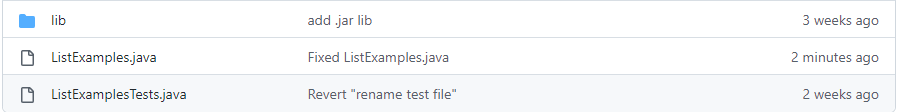
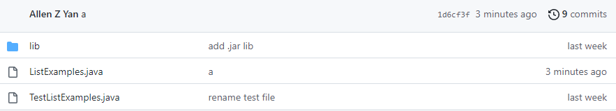

# Week 7 Lab Report
By: Allen Yan

PID: A17685719

---
Most of the steps that I used for this lab report were possible because I used them previously.

For the first step, logging into ieng6, I used `<ctrl-r>` and searched "ssh" and pressed `<enter>` which gave me the command to log in. The first time I entered the command, I typed it out manually. 

To clone the github repo, I also used `<ctrl-r>` and searched "git", then pressed `<enter>` which gave me the command and cloned everything into a directory called lab7/ in the ieng6 account. Originally, I had to copy the ssh link from github by pressing "code" and in the dropdown menu, pressing "ssh" and copying the link, and then type "git clone " and paste the link with `<ctrl-v>`, the press `<enter>` to run the command.

Then, to go into the directory, I typed "cd l" and pressed `<tab>` to autocomplete the command to `cd lab7/`.

To run the code, I used `<ctrl-r>` and searched "ac" which brought up the command `javac -cp .:lib/hamcrest-core-1.3.jar:lib/junit-4.13.2.jar *.java` to compile all .java files, and pressed `<enter>`. Then I used `<ctrl-r>` again and searched "-cp" to get the command `java -cp .:lib/hamcrest-core-1.3.jar:lib/junit-4.13.2.jar org.junit.runner.JUnitCore TestListExamples` which runs the tester file.

To fix the bug, I typed "nano L" and pressed `<tab>`, then typed "j" and pressed `<tab>` again, then pressed `<enter>`. This runs the command to edit the .java file within the command line.

In the nano window, I pressed `<page down>` to get to the bottom of the file, pressed `<up>` 7 times, `<right>` 11 times, `<del>`, and then typed "2". I saved the file with `<ctrl-o>` and `<enter>`, then exited with `<ctrl-x>`.

I had to compile and run the test again so I pressed `<up>` 3 times and `<enter>`, which found and ran the previous compile command, then pressed `<up>` 3 times and `<enter>` again, to get the java command and run the test file

I used `<ctrl-r>`, searched "ad" to find the command `git add ListExamples.java`, and pressed `<enter>`, and this was possible because I previously typed out "git add L" and pressed `<tab>`, then typed "j" and pressed `<tab>` to run the command for the first time. Then I used `<ctrl-r>` again, searched "com" to find the command `git commit -m "a"`, and pressed `<enter>`, and this was also possible because I previously typed out the whole command earlier. The "a" was used as a filler for the commit message to decrease the time. Lastly, I used `<ctrl-r>`, searched "pu" to find the command `git push`, and pressed `<enter>`, and again, this was possible because I typed out the whole command earlier as well.

Then I checked github and refreshed it to see the new commit with ListExamples.java.

