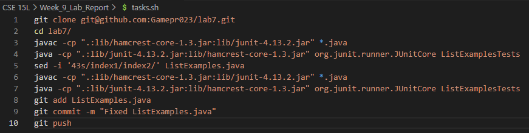
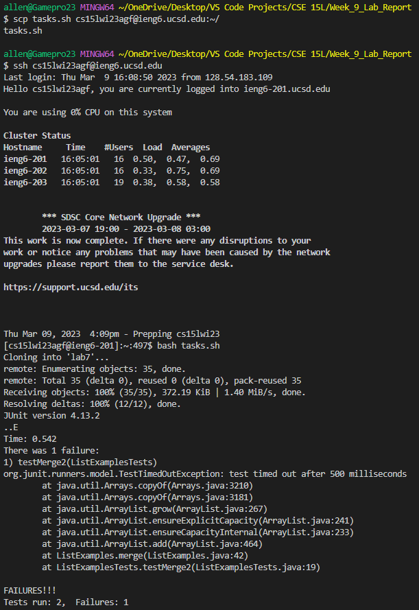
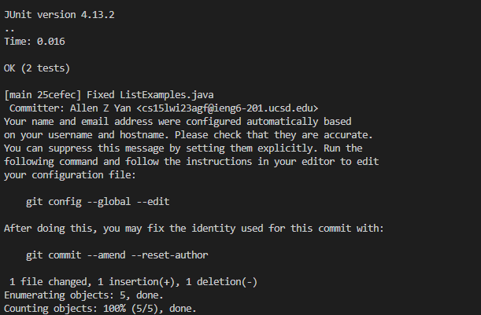
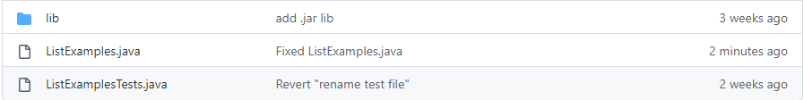
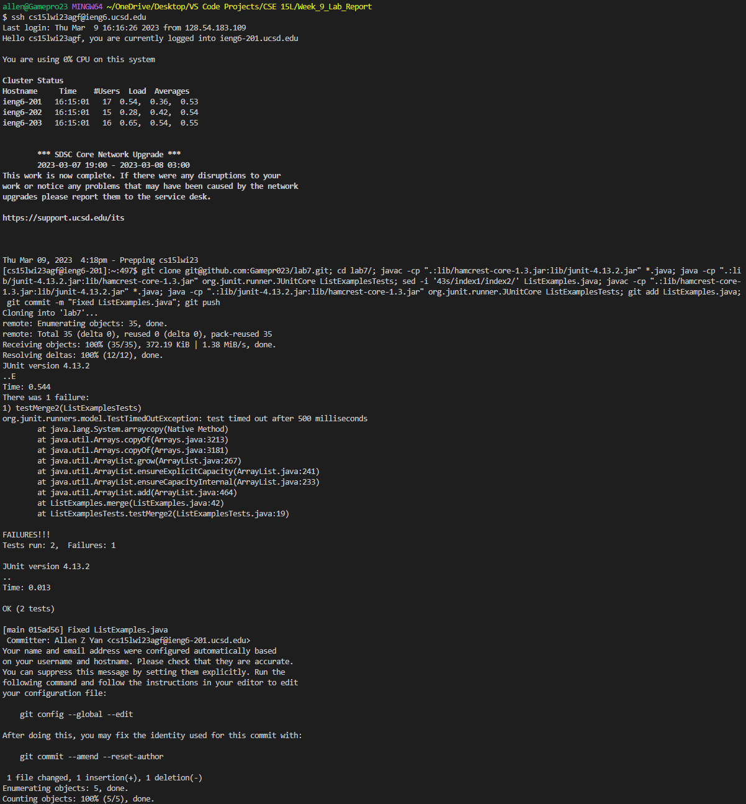

# Week 9 Lab Report
By: Allen Yan

PID: A17685719

---
In this lab report, I am going to talk about how I could've done the lab challenge task from week 7 quickly with a bash script.

First, I would have to make a bash script before the challenge which would have all of the commands. It would look like this:

To be able to use the script, I would have to copy it into the remote server using the command: `scp tasks.sh cs15lwi23agf@ieng6.ucsd.edu:~/`
This would most likely already be typed so I just have to hit up arrow twice and then enter to run the command.

Then, I would log in using `ssh cs15lwi23agf@ieng6.ucsd.edu`, then immediately run `bash tasks.sh` which would run the bash script and complete all of the tasks instantly.

---

This shows that the file was successfully pushed to GitHub.

---
During the actual challenge, since bash scripts weren't allowed, people had all of the commands copied and put into one long input, with the commands separated by semicolons.

It would look something like this:

By doing this, you could get a much faster time since you don't need to copy a bash script to the remote server.